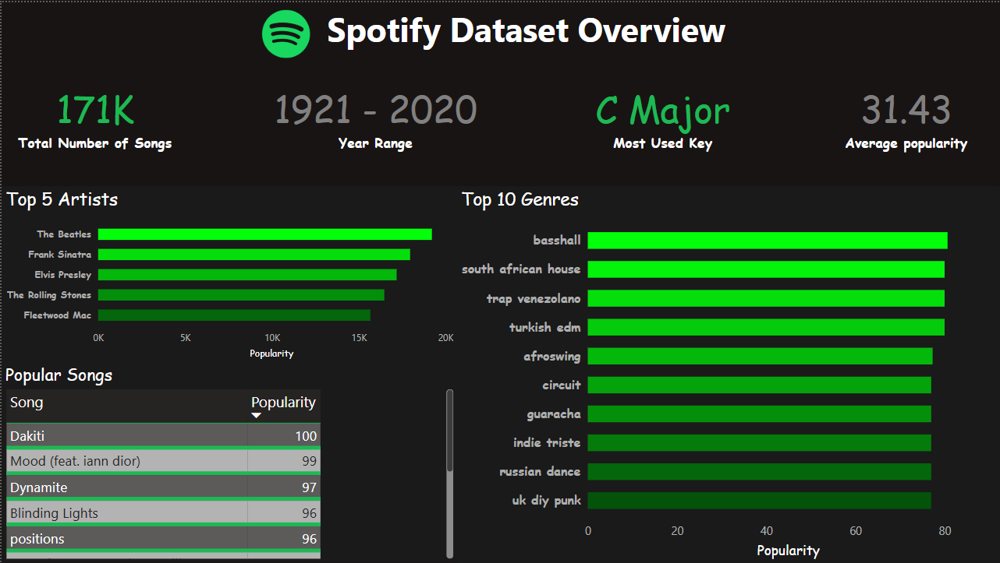

# 🎵 Spotify Music Trends Dashboard

This project explores Spotify music trends over the years using a visually rich **Power BI Dashboard** hosted via **GitHub Pages**.

---

## 📊 Live Dashboard Page

🔗 **Interactive Power BI Dashboard (Download & Preview)**  
👉 [https://kasra-noorbakhsh.github.io/Spotify-Dashboard/](https://kasra-noorbakhsh.github.io/Spotify-Dashboard/)

> 📝 Open the `.pbix` file in Power BI Desktop to interact with the dashboard.

---

## 📌 Project Highlights

- 🎼 **Genres and Keys**: Visualize how music keys and genres vary across tracks  
- 📅 **Trends Over Years**: See how musical attributes like tempo and energy have evolved  
- 📊 **Distributions**: Track popularity, loudness, danceability, and other metrics  
- 🔗 **Relations**: Discover how features like tempo and valence relate  
- 🗃️ **Dataset Overview**: Basic statistics and summary of the dataset

---

## 🧰 Tools Used

- [Microsoft Power BI](https://powerbi.microsoft.com/)
- [GitHub Pages](https://pages.github.com/)

---

## 🖼️ Preview

> ⚠️ This is a static image. To explore all tabs and filters, download and open the `.pbix` file.

---

## 🚀 How to Use

1. Visit the GitHub Pages site linked above.
2. Click the download link to get the `.pbix` file.
3. Open it in **Power BI Desktop** to explore the full interactive dashboard.
4. Fork or clone this repo to showcase your own Power BI projects.

---

## 📬 Contact

Made by **Kasra Noorbakhsh**  
📧 Feel free to connect or provide feedback!
